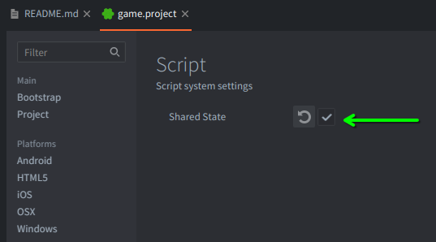

# Defrend (pronounced "de-friend")

Defrend is a deferred 3D rendering pipeline for the Defold game engine. It provides a collection of materials, shaders, scripts, and other components to facilitate the creation of 3D scenes with modern lighting and post-processing effects. Defrend currently offers the following:

- directional lighting
- deferred, instanced point lights and spot lights
- normal, specular, and emissive maps
- stable, cascaded shadow mapping
- billboard images and sprites
- deferred, instanced decals
- skyboxes
- SSAO
- glow effects
- FXAA
- dual Kawase blur
- Gaussian blur
- outline effects
- comprehensive debug visualizations for the g-buffer, lighting buffers, shadow partitions, shadow map, ssao buffer, etc.
- comprehensive GUI for dynamically configuring all the aforementioned features

In addition to the preceding, Defrend also offers experimental versions of the following features, currently works-in-progress:

- depth of field
- kuwahara blur
- bloom
- gamma correction

Please take a look at the **[web demo](https://akhleung.github.io/Defrend/index.html)** to get a feel for this library's capabilities (left-click and drag to rotate the camera around the scene; middle-click and drag to move the camera vertically and laterally; use the scroll wheel to move the camera forward and backward).

## Table of contents

- [Requirements](#requirements)
- [Getting started](#setup)

## Requirements

- requires Defold version 1.11.1 or higher
- in the `game.project` file, under the `Script` section, make sure that `Shared State` is checked, as Defrend uses numerous singleton modules to share state between various components:  

## Getting started

First, add Defrend as an external dependency in your Defold project. You can either use the master archive for the latest development version, or one of the releases linked in the sidebar (preferably the latest). E.g.:

    https://github.com/akhleung/defrend/archive/master.zip

or

    https://github.com/akhleung/defrend/archive/refs/tags/1.6.1.zip

