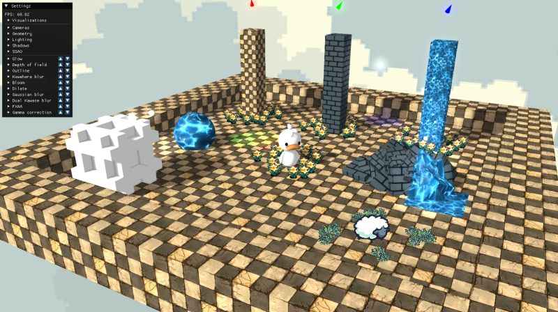

# Defrend (pronounced "de-friend")

Defrend is a deferred 3D rendering pipeline for the Defold game engine. It provides a collection of materials, shaders, scripts, and other components to facilitate the creation of 3D scenes with modern lighting and post-processing effects. Defrend currently offers the following:

- directional lighting
- deferred, instanced point lights and spot lights
- normal, specular, and emissive maps
- stable, cascaded shadow mapping
- billboard images and sprites
- deferred, instanced decals
- skyboxes
- SSAO
- glow effects
- FXAA 3
- dual Kawase blur
- Gaussian blur
- outline effects
- comprehensive debug visualizations for the g-buffer, lighting buffers, shadow partitions, shadow map, ssao buffer, etc.
- comprehensive GUI for dynamically configuring all the aforementioned features

In addition to the preceding, Defrend also offers experimental versions of the following features, currently works-in-progress:

- depth of field
- kuwahara blur
- bloom
- gamma correction

Please take a look at the **[web demo](https://akhleung.github.io/Defrend/index.html)** to get a feel for this library's capabilities (left-click and drag to rotate the camera around the scene; middle-click and drag to move the camera vertically and laterally; use the scroll wheel to move the camera forward and backward):

## Table of contents

- [Requirements](docs/requirements.md)
- [Getting started](docs/getting_started.md)
- [Renderable objects / materials](docs/materials.md)
    - [Models](docs/materials.md#models)
    - [Billboards / sprites](docs/materials.md#billboards-and-sprites)
    - [Particle FX](docs/materials.md#particle-fx)
    - [Decals](docs/materials.md#decals)
    - [Skybox](docs/materials.md#Skybox)
- [Lighting](docs/lighting.md)
- [Post-processing](docs/post_processing.md)
- [Visualizations / debugging](docs/visualizations.md)
