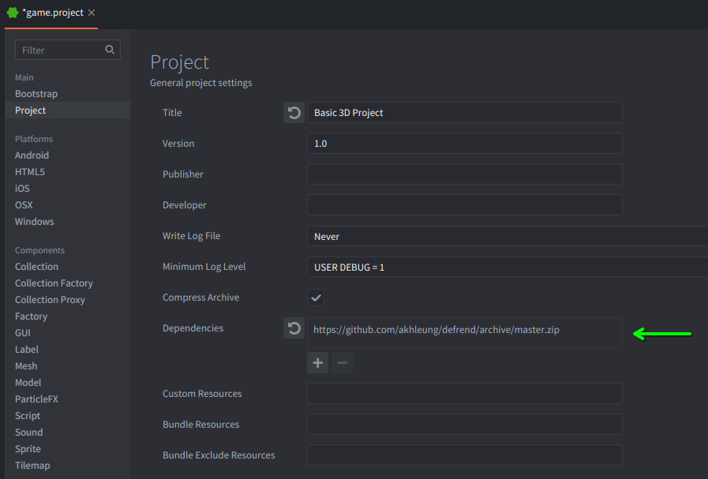
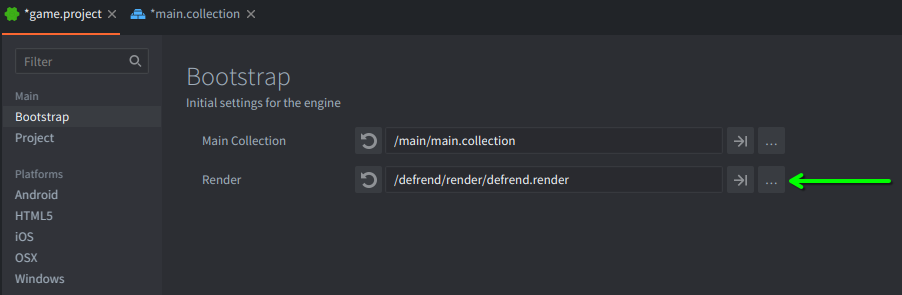
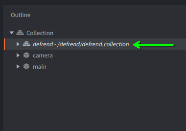
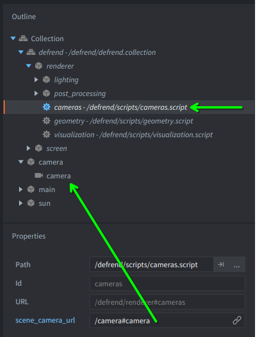
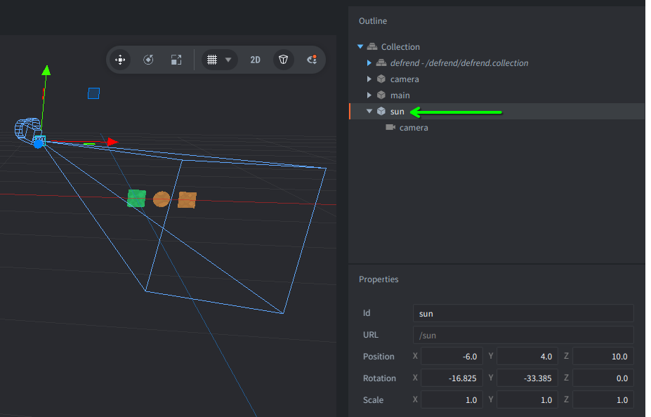
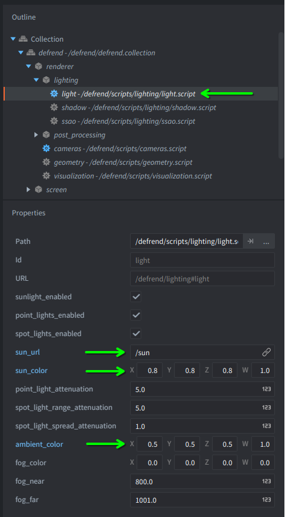
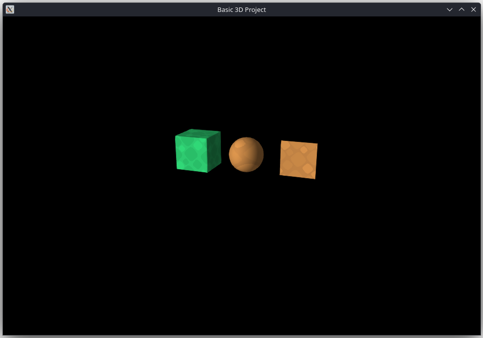

# Getting started

 (This Getting Started guide was tested on the "Basic 3D Project" template that comes with Defold.)

## 1. Add the dependency

First, add Defrend as an external dependency in your Defold project. You can either use the [master archive](https://github.com/akhleung/defrend/archive/master.zip) for the latest development version, or one of the [releases](https://github.com/akhleung/defrend/releases) (preferably the latest). E.g.:

    https://github.com/akhleung/defrend/archive/master.zip

or

    https://github.com/akhleung/defrend/archive/refs/tags/1.6.1.zip

## 2. Add `defrend.render` to your project bootstrap settings

In the `game.project` file, under the Bootstrap section, in the Render box, select `/defrend/render/defrend.render`:

## 3. Add `defrend.collection` to your project outline

In your bootstrap collection (or whichever collection requires 3D rendering), add the collection file `/defrend/defrend.collection`. This collection file is supplied by Defrend and provides numerous components and scripts for initializing and configuring the various features of the library.

*Note: after this step, you may need to restart Defold if textures do not appear correctly when viewing models in the editor. The shading on models may also appear flat/unlit; this is because the deferred pipeline introduces many additional stages that the Defold editor is currently unable to integrate and preview.*

## 4. Add a camera and light source

In order to view your 3D scene, there must be a camera and at least one light, and their URLs must be provided to Defrend.

First, add a camera component to the project outline; this will be the *scene camera*, and rendering will be done from its point of view. Then, in `defrend.collection` in the project outline, select the `defrend | renderer | cameras` script component. In the `scene_camera_url` field, enter the URL of the camera component (Defrend needs to know which camera is being used to render the scene in order to perform shadow mapping correctly).

Next, add a GO (game object) to the project outline to represent a directional light source. Since directional lights are generally intended to simulate sunlight, name this GO `sun`. Add a camera component to the `sun` so that you can visualize its orientation more easily. Then move and rotate the `sun` so that the light points in the desired direction.

Then, in the project outline, select `defrend | renderer | lighting | light`, and in the `sun_url` field, paste the URL of the `sun` GO. Also adjust the intensity of the sunlight and ambient light to lower values.

## 5. Add 3D models with the appropriate materials

Assuming your project has model assets ready to use, open them up and set their default material to `/defrend/materials/geometry/model/model.material`, provided by Defrend. Note that compared to Defold's built-in model material, the Defrend version requires a normal map and specular/glow map to be specified in addition to the usual diffuse/albedo map. For convenience, Defrend provides `/defrend/assets/textures/flat.png` and `/defrend/assets/textures/black.png` that should be used as defaults if your project does not require normal mapping, specular reflections, or glow effects.

Add your models to the scene, make sure your camera and lights are positioned and oriented accordingly, and run the project. In the case of the "Basic 3D Project" that was adapted for this guide, the result should look like the following:

## 6. Add the configuration GUI

Finally, during development of your 3D project, it is recommended that you add the configuration GUI so that all the rendering and post-processing settings can be adjusted dynamically, with the results immediately visible.

## Next steps

At this point, you should be equipped to get Defrend up and running with your own projects. Please consult the rest of the documentation for information on how to use the library's more interesting and advanced features.