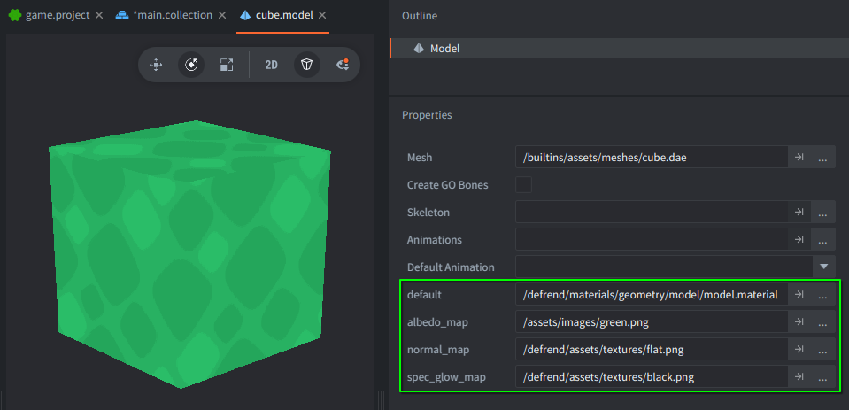
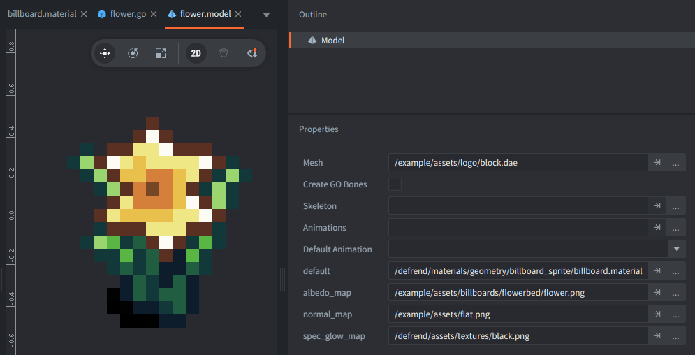
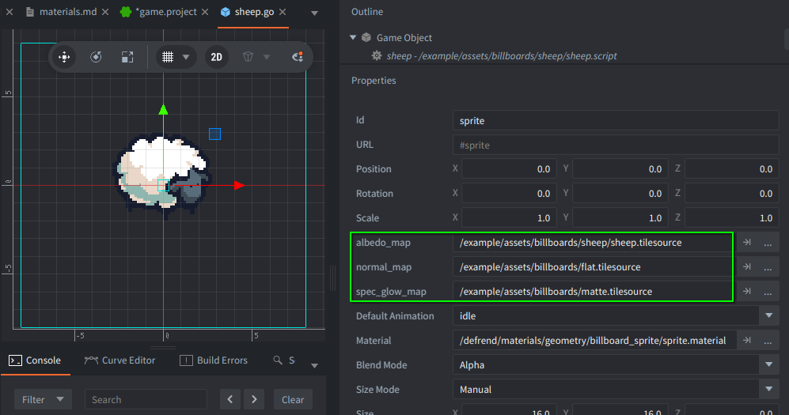
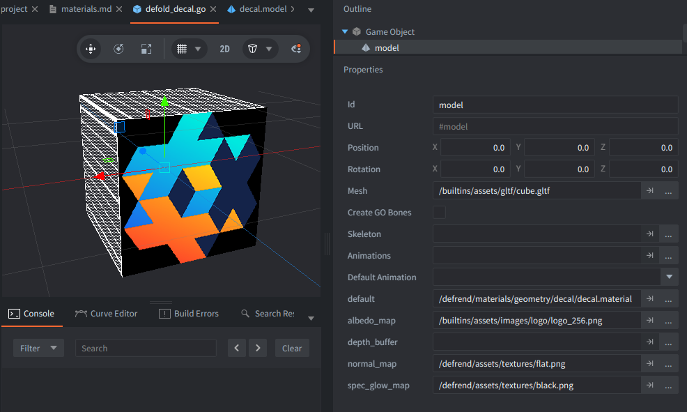
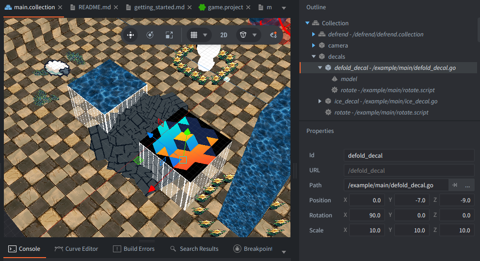
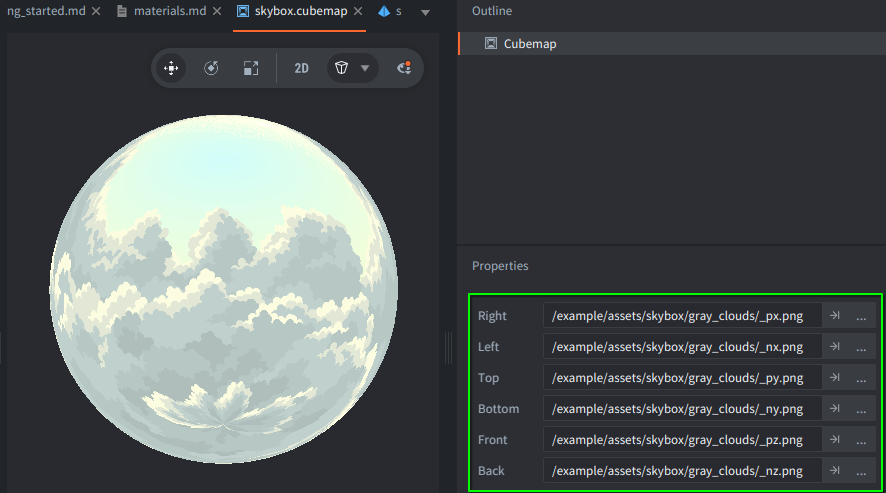
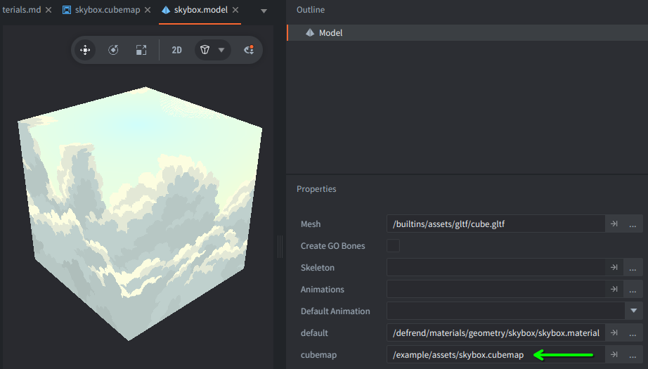

# Materials / renderable objects

Defrend provides a number of materials that should be used instead of the built-in ones so that rendered objects can be correctly lit. Defrend also offers some materials / types of objects that have no built-in counterparts such as billboards, decals, and skyboxes. This section covers all of these materials.

## Models

The model material is used to render the typical 3D object, represented by a model component in Defold. The material file can be found at:

`/defrend/materials/geometry/model/model.material`

This model material takes advantage of GPU instancing so that many duplicate objects can be rendered in a performant manner. This is ideal if the scene contains large numbers of copies or reusable modular elements (e.g., foliage, modular buildings or vehicles, props, hordes of characters, etc).

When using the model material, three textures must be provided: an **albedo map**, **normal map**, and **specular / glow map**.

The **albedo map** represents the "base color" or "diffuse color" of the object. The **normal map** provides surface normals. The **specular / glow map** combines information about specularity and emissiveness, with the red channel containing specularity and the green channel containing emissiveness. Because Defrend's focus is more on stylized and non-photorealistic rendering, specularity and emissiveness are simple scalar values; specular reflections are white, and emissive color is based on the underlying albedo of the object.

If an object does not require normal mapping, specular reflections, or glow effects, then Defrend provides the following default textures:

`/defrend/assets/textures/flat.png` for plain, flat surfaces

`/defrend/assets/textures/black.png` for matte, non-emissive surfaces

Defrend currently does not support non-instanced or skinned models, but these can easily be added to the pipeline.

## Billboards

The billboard material is used to render static billboards -- 2D images that always face the camera. These are generally used to mimic 3D objects in order to achieve a retro aesthetic, or to represent "imposter" objects for reduced levels of detail in faraway parts of a scene. The material file can be found at:

`/defrend/materials/geometry/billboard_sprite/billboard.material`

>[!NOTE]
> In Defrend, billboards only rotate around the Y axis in order to mimic the appearance of characters and props in early first-person 3D games. In the future, an option will be added to enable rotation along the other axes as well, or disable it altogether.

The billboard material should be applied to a quad or a cube model component (the reason for using a cube is that frustum culling may be more accurate; the material works by transforming the billboard's vertices in the shader, but a quad billboard may already have been culled too eagerly if it was originally oriented toward the camera edge-on, and was just outside the field of view).

As with [models](#models), billboards require an **albedo map**, **normal map**, and **specular / glow map**, which serve the same purposes as above. The albedo maps for billboards are expected to contain completely transparent regions, which will be rendered as completely transparent. As with models, you can use the included `flat.png` and `black.png` textures if normals, specularity, and emissiveness are not required. For an example of all this, please examine the `/example/assets/billboards/flowerbed/flower.go` object.

## Sprites

The sprite material is used to render animated [billboards](#billboards) using the built-in sprite component. The material file can be found at:

`/defrend/materials/geometry/billboard_sprite/sprite.material`

>[!NOTE]
> In Defrend, billboard sprites only rotate around the Y axis in order to mimic the appearance of characters and props in early first-person 3D games. In the future, an option will be added to enable rotation along the other axes as well, or disable it altogether.

As with [models](#models), sprite billboards require an **albedo map**, **normal map**, and **specular / glow map**, which serve the same purposes as above. Tile sources should be constructed out of these texture maps and provided to the material configuration:

The albedo maps for sprite billboards are expected to contain completely transparent regions, which will be rendered as completely transparent. As with models, you can use the included `flat.png` and `black.png` textures if normals, specularity, and emissiveness are not required. For an example of all this, please examine the `/example/assets/billboards/sheep/sheep.go` object.

## Particle FX

The particle materials are used to render the built-in particle fx component, treating the particle images as billboards. There are two separate materials; `particle.material` should be used for particle fx that cast shadows, and `shadowless_particle.material` should be used for particle fx that don't cast shadows. The material files can be found at:

`/defrend/materials/geometry/billboard_sprite/particle.material`

`/defrend/materials/geometry/billboard_sprite/shadowless_particle.material`

>[!NOTE]
> In Defrend, particle fx are billboarded along all axes. In the future, an option will be added to selectively enable / disable billboarding along specific axes.

To create a billboarded particle fx, follow the same process as creating a built-in Defold particle fx, but apply one of the aforementioned Defrend materials.

Unlike [billboards](#billboards) and [sprites](#sprites), particle fx in Defrend only use an albedo map tilesource. The materials do, however, also take a vec4 fragment constant called `spec_glow_dith` that contains flags indicating whether the particles should be shiny, emissive, and/or dithered (i.e., translucent). These flags can be set with Defold's built-in `particlefx.set_constant` function; a convenient place to do this is in a script component attached to a GO that also contains the particle fx component. Please examine the files in `/example/assets/billboards/dust` for an example.

>[!NOTE]
> After applying Defrend's particle materials, the Defold editor will no longer be able to preview the particle fx, due to the highly customized deferred pipeline. You can apply the built-in material first for a preview, then switch to the Defrend version.

## Decals

The decal material is used to project a 2D image onto a 3D surface; the projected image is called a *decal*, as the name of this material implies. The material file can be found at:

`/defrend/materials/geometry/decal/decal.material`

To create a decal, first create a *decal projector box* using a cube-shaped model component (Defold's built-in cube model is fine), assign the decal material to it, and then assign the textures that you want to project. Note that decals, as with [models](#models), also require an **albedo map**, **normal map**, and **specular / glow map**, which serve the same purposes as above. You can use the included `flat.png` and `black.png` textures if normals, specularity, and emissiveness are not required.

>[!NOTE]
> The decal material projects the decal in the positive Z direction, relative to the projector box's local coordinates. In the editor, the visualization for the projector box shows the decal image on the negative Z side, to assist with orienting the projector box correctly.

To use a decal, place the projector box in your scene, and position / orient it so that its positive Z face intersects with whatever object it should be projected on.

>[!NOTE]
> A decal will not be rendered if the camera moves inside its projector box. To minimize the chances of this, try to make the projector box as flat as possible along its Z axis. This should also improve rendering performance, as a flatter (and hence smaller) box will require fewer fragments to be processed and discarded by the decal material's fragment shader.

For an example of all this, please examine the `/example/assets/models/decal.go` and `/example/main/defold_decal.go` objects.

## Skybox

The skybox material is used to create backdrops (i.e., *skyboxes*) that surround your 3D scene. A skybox is rendered as if the camera is inside it, and its sides are at the camera's far plane; hence, the backdrops appear behind all other rendered objects, and they appear to follow the camera, similar to how distant scenery in the real world appears to move with your point of view. The skybox material can be found at:

`/defrend/materials/geometry/skybox/skybox.material`

To create a skybox, you must first create a cubemap component, and provide six background images that will form the six sides:

Each side of the cubemap will correspond to one side of the skybox. The sides of the skybox are aligned with the X, Y, and Z axes in world space. Appropriate cubemap images can be found online, along with tools for creating cubemap images from other types of images.

Once you have a cubemap, create a model component for the skybox, specifying a cube mesh (Defold's built-in cube mesh is fine). Assign the skybox material, and provide your cubemap in the appropriate field:

Once you have a skybox, place it anywhere in your 3D scene. The Defold editor is currently unable to show the skybox as it would actually appear in a build, so it will instead only appear as a small cube in the editor.

For an example of all this, please examine `/example/assets/models/skybox.model`, and its usage in the example scene at `/example/main/main.collection`.

## Point lights and spot lights

Point lights and spot lights are represented by geometries in Defrend, and hence have custom materials as well. However, because they affect the lighting of the scene, they are described in the [Lighting](lighting.md) section of the documentation.
